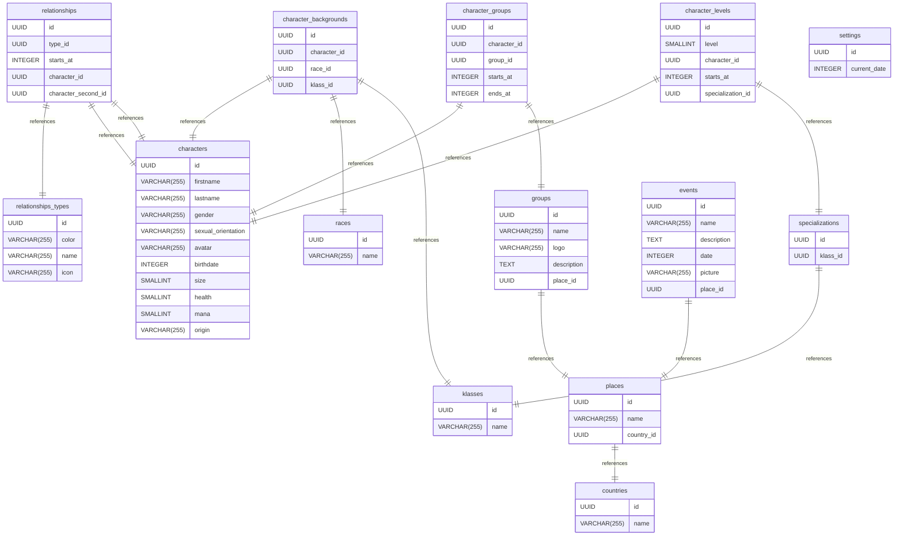

# NoPainNoCampaign documentation
## Summary

- [Introduction](#introduction)
- [Database Type](#database-type)
- [Table Structure](#table-structure)
	- [characters](#characters)
	- [character_backgrounds](#character_backgrounds)
	- [races](#races)
	- [klasses](#klasses)
	- [events](#events)
	- [relationships](#relationships)
	- [relationships_types](#relationships_types)
	- [groups](#groups)
	- [character_groups](#character_groups)
	- [settings](#settings)
	- [specializations](#specializations)
	- [character_levels](#character_levels)
	- [places](#places)
	- [countries](#countries)
- [Relationships](#relationships)
- [Database Diagram](#database-Diagram)

## Introduction

## Database type

- **Database system:** PostgreSQL
## Table structure

### characters

| Name        | Type          | Settings                      | References                    | Note                           |
|-------------|---------------|-------------------------------|-------------------------------|--------------------------------|
| **id** | UUID | 🔑 PK, not null, unique |  | |
| **firstname** | VARCHAR(255) | not null |  | |
| **lastname** | VARCHAR(255) | null |  | |
| **gender** | VARCHAR(255) | null |  | |
| **sexual_orientation** | VARCHAR(255) | null |  | |
| **avatar** | VARCHAR(255) | null |  | |
| **birthdate** | INTEGER | null |  | |
| **size** | SMALLINT | null |  | |
| **health** | SMALLINT | null |  | |
| **mana** | SMALLINT | null |  | |
| **origin** | VARCHAR(255) | null |  | | 

### character_backgrounds

| Name        | Type          | Settings                      | References                    | Note                           |
|-------------|---------------|-------------------------------|-------------------------------|--------------------------------|
| **id** | UUID | 🔑 PK, not null, unique |  | |
| **character_id** | UUID | not null | fk_character_backgrounds_character_id_characters | |
| **race_id** | UUID | not null | fk_character_backgrounds_race_id_races | |
| **klass_id** | UUID | not null | fk_character_backgrounds_klass_id_klasses | | 

### races

| Name        | Type          | Settings                      | References                    | Note                           |
|-------------|---------------|-------------------------------|-------------------------------|--------------------------------|
| **id** | UUID | 🔑 PK, not null, unique |  | |
| **name** | VARCHAR(255) | not null |  | | 

### klasses

| Name        | Type          | Settings                      | References                    | Note                           |
|-------------|---------------|-------------------------------|-------------------------------|--------------------------------|
| **id** | UUID | 🔑 PK, not null, unique |  | |
| **name** | VARCHAR(255) | null |  | | 

### events

| Name        | Type          | Settings                      | References                    | Note                           |
|-------------|---------------|-------------------------------|-------------------------------|--------------------------------|
| **id** | UUID | 🔑 PK, not null, unique |  | |
| **name** | VARCHAR(255) | not null |  | |
| **description** | TEXT | null |  | |
| **date** | INTEGER | not null |  | |
| **picture** | VARCHAR(255) | null |  | |
| **place_id** | UUID | null | fk_events_place_id_places | | 

### relationships

| Name        | Type          | Settings                      | References                    | Note                           |
|-------------|---------------|-------------------------------|-------------------------------|--------------------------------|
| **id** | UUID | 🔑 PK, not null, unique |  | |
| **type_id** | UUID | not null | fk_relationships_type_id_relationships_types | |
| **starts_at** | INTEGER | not null |  | |
| **character_id** | UUID | null | fk_relationships_character_id_characters | |
| **character_second_id** | UUID | null | fk_relationships_character_second_id_characters | | 

### relationships_types

| Name        | Type          | Settings                      | References                    | Note                           |
|-------------|---------------|-------------------------------|-------------------------------|--------------------------------|
| **id** | UUID | 🔑 PK, not null, unique |  | |
| **color** | VARCHAR(255) | not null |  | |
| **name** | VARCHAR(255) | not null |  | |
| **icon** | VARCHAR(255) | null |  | | 

### groups

| Name        | Type          | Settings                      | References                    | Note                           |
|-------------|---------------|-------------------------------|-------------------------------|--------------------------------|
| **id** | UUID | 🔑 PK, not null, unique |  | |
| **name** | VARCHAR(255) | not null |  | |
| **logo** | VARCHAR(255) | null |  | |
| **description** | TEXT | null |  | |
| **place_id** | UUID | null | fk_groups_place_id_places | | 

### character_groups

| Name        | Type          | Settings                      | References                    | Note                           |
|-------------|---------------|-------------------------------|-------------------------------|--------------------------------|
| **id** | UUID | 🔑 PK, not null, unique |  | |
| **character_id** | UUID | not null | fk_character_groups_character_id_characters | |
| **group_id** | UUID | not null | fk_character_groups_group_id_groups | |
| **starts_at** | INTEGER | null |  | |
| **ends_at** | INTEGER | null |  | | 

### settings

| Name        | Type          | Settings                      | References                    | Note                           |
|-------------|---------------|-------------------------------|-------------------------------|--------------------------------|
| **id** | UUID | 🔑 PK, not null, unique |  | |
| **current_date** | INTEGER | null |  | | 

### specializations

| Name        | Type          | Settings                      | References                    | Note                           |
|-------------|---------------|-------------------------------|-------------------------------|--------------------------------|
| **id** | UUID | 🔑 PK, not null, unique |  | |
| **klass_id** | UUID | not null | fk_specializations_klass_id_klasses | | 

### character_levels

| Name        | Type          | Settings                      | References                    | Note                           |
|-------------|---------------|-------------------------------|-------------------------------|--------------------------------|
| **id** | UUID | 🔑 PK, not null, unique |  | |
| **level** | SMALLINT | not null |  | |
| **character_id** | UUID | not null | fk_character_levels_character_id_characters | |
| **starts_at** | INTEGER | null |  | |
| **specialization_id** | UUID | null | fk_character_levels_specialization_id_specializations | | 

### places

| Name        | Type          | Settings                      | References                    | Note                           |
|-------------|---------------|-------------------------------|-------------------------------|--------------------------------|
| **id** | UUID | 🔑 PK, not null, unique |  | |
| **name** | VARCHAR(255) | null |  | |
| **country_id** | UUID | null | fk_cities_country_id_countries | | 

### countries

| Name        | Type          | Settings                      | References                    | Note                           |
|-------------|---------------|-------------------------------|-------------------------------|--------------------------------|
| **id** | UUID | 🔑 PK, not null, unique |  | |
| **name** | VARCHAR(255) | null |  | | 

## Relationships

- **character_backgrounds to characters**: one_to_one
- **character_backgrounds to races**: one_to_one
- **character_backgrounds to klasses**: one_to_one
- **relationships to relationships_types**: one_to_one
- **relationships to characters**: one_to_one
- **relationships to characters**: one_to_one
- **character_groups to characters**: one_to_one
- **character_groups to groups**: one_to_one
- **specializations to klasses**: one_to_one
- **character_levels to characters**: one_to_one
- **character_levels to specializations**: one_to_one
- **places to countries**: one_to_one
- **events to places**: one_to_one
- **groups to places**: one_to_one

## Database Diagram

